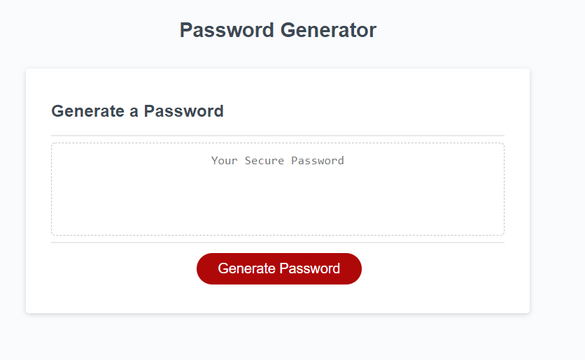
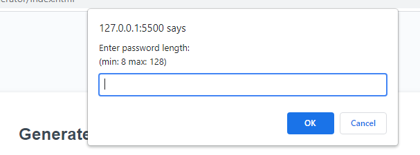
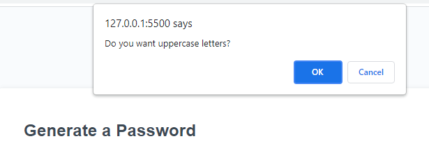
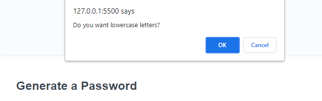
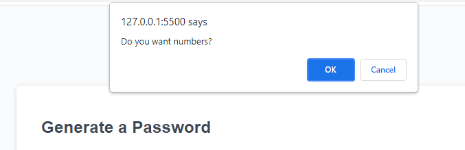
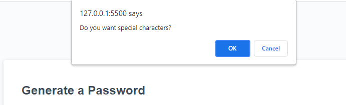
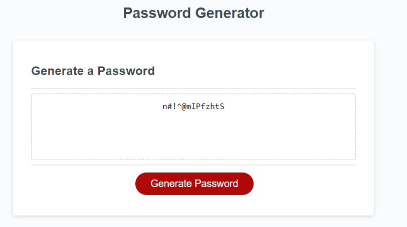

# w3-hw-password-generator

Created javascripting to prompt users to input desired character length and choose what character types to use for the password generated.

https://robertcalder1.github.io/w3-hw-password-generator/

